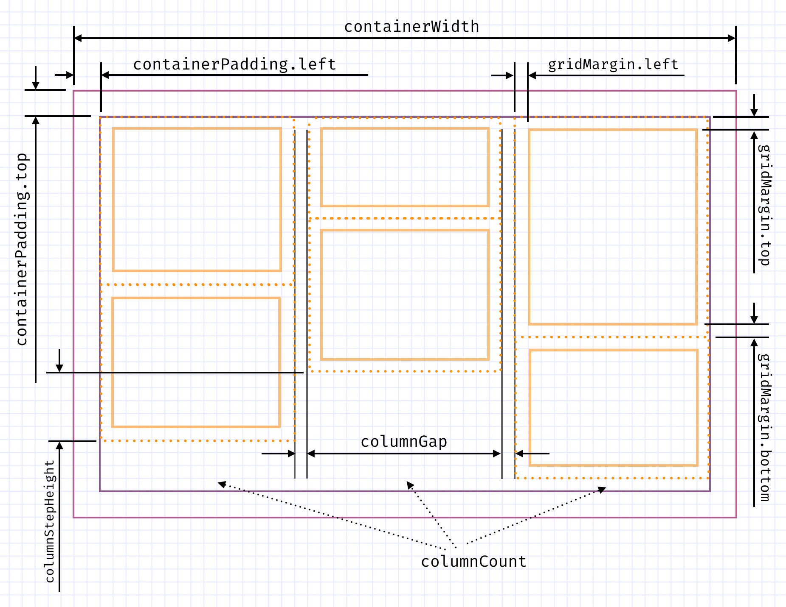

# Waterfall Layout

Calculate width &amp; position for items of waterfall

```js
import layout from 'waterfall-layout'

layout(items, options = {}) // => { grids, containerHeight }
```

Options for layouting are listed in [sample](example/index.js#L5-L22)


